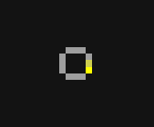

# wiregame

A game where you play with wires.

[CHECK IT OUT!](https://wiregame.bithole.dev/)

A Golly rule for WireGame is also available [here](assets/WireGame.rule).

# For Developers

Circuits are encoded as lists of cells. Each cell has the following format:

```
x,y,type
```

Cells are joined with semicolons. There must not be any extraneous spaces. All circuits must match the following regex:

```
^(?:-?\d+,-?\d+,\d+;)*-?\d+,-?\d+,\d+$
```

For example, here's a small example circuit and its encoded form:



```
27,11,0;28,11,0;26,11,0;25,12,0;25,13,0;25,14,0;26,15,0;27,15,0;28,15,0;29,14,1;29,13,2;29,12,0
```

Here is a list of cell types:

* 0: Wire
* 1: Electron Head
* 2: Electron Tail
* 3: Switch
* 4: Active Switch

To retrieve a circuit, use the `/api/circuits/<id>` endpoint. Here is an example response:

```json
{
    "id": 76,
    "title": "loop",
    "data": "27,11,0;28,11,0;26,11,0;25,12,0;25,13,0;25,14,0;26,15,0;27,15,0;28,15,0;29,14,1;29,13,2;29,12,0",
    "views": 1,
    "cells": 12,
    "previewExists": 1
}
```

The preview image for the circuit is available at `/previews/<id>.png`.

To retrieve a list of all circuits, use `/api/circuits`:

```json
[
    {
        "id": 4,
        "title": "aaaaaaaaaaaa",
        "views": 31,
        "cells": 68
    },
    {
        "id": 3,
        "title": "w",
        "views": 48,
        "cells": 14
    },
    {
        "id": 1,
        "title": "hello, world",
        "views": 55,
        "cells": 21
    }
]
```

To upload a circuit, make a POST request to `/circuit`. The Content-Type header should be set to application/json, and the request body should be a JSON object with the following fields:
* `data`: a valid WireGame circuit
* `title`: title of the circuit